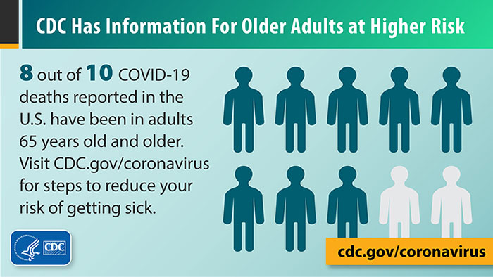

# 001. 80/20 Rule
#### aka: Pareto's Principle, Juran's Principle, and Vital Few and Trivial Many Rule
##### May 7, 2021

The 80/20 rule says that 20% of something in a system is responsible for 80% of something else (to put it generally). In 1896, [Vilfredo Pareto](https://en.wikipedia.org/wiki/Vilfredo_Pareto) discovered approximately 80% of the land in Italy was owned by 20% of the population. Since then, [Joseph Juran](https://en.wikipedia.org/wiki/Joseph_M._Juran) applied Pareto's thought to management theory and garnered renown for this seemingly universal law. Lidwell, Holden, and Butler note that the 80/20 rule affects any large system; it is seen in business, economics, design, social science, and practically every other field.

## Non-digital example

According to the Center for Disease Control, 8 out of 10 COVID-19 deaths in the U.S. have been people 65 years and older—that is, 16+% of the U.S. population (Center for Disease Control, n.d.; World Bank, 2020). In other words, ~20% of the population is subject to 80% of these deaths.

## Digital example

Aryan Indraksh (2020) writes:
> Don’t build and optimize for 80% of the population that rarely visits you. Build for the 20% that are loyal and regularly visits you.

I suppose that this applies to any design, not just the digital type. In this quoted article, however, Indraksh takes the perspective of a digital UX designer and optimizing for the population that provides the majority of your traffic. **But wait. Accessibility who?** I must disagree with Indraksh to some degree—while it is impossible to design for every use case, it is imperative not to exclude. If you are designing for the 80% of use cases, don't forget about the 1 in 5 others!

Alternatively, Google's home page features the search bar prominently. While there are links to other services on the same page, *my guess* is that single search bar function contributes to the large majority of use cases for that page.

## 3D model

As inspired by Better Explained's article on the 80/20 rule, I aim to produce several objects at what I think might be "20% detail". The idea is that 20% detail (a sketch, essentially) can communicate the bulk of the goal. For the several objects, I will aim to create interior objects such as architectural structures, furniture, and other objects.

## References

Better Explained (n.d.). *Understanding the Pareto Principle (the 80/20 rule)*. Retrieved May 28, 2021 from [https://betterexplained.com/articles/understanding-the-pareto-principle-the-8020-rule/](https://betterexplained.com/articles/understanding-the-pareto-principle-the-8020-rule/)

Center for Disease Control (n.d.). *Older adults*. Retrieved May 28, 2021 from [https://www.cdc.gov/coronavirus/2019-ncov/need-extra-precautions/older-adults.html](https://www.cdc.gov/coronavirus/2019-ncov/need-extra-precautions/older-adults.html)

Elmansy, R. (n.d.). *80/20 rule: From economics to design*. Designorate. Retrieved May 28, 2021 from [https://www.designorate.com/80-20-rule-design/](https://www.designorate.com/80-20-rule-design/)

Indraksh, A. (2020, May 1). *80/20 rule — how the Pareto Principle is helping designers in 2020?* UX Collective (Medium). Retrieved May 9, 2021 from [https://uxdesign.cc/80-20-rule-how-the-pareto-principle-is-helping-designers-in-2020-7207b75f2f40](https://uxdesign.cc/80-20-rule-how-the-pareto-principle-is-helping-designers-in-2020-7207b75f2f40)

Web Designer Depot (2011, February 14). *The 80/20 rule applied to web design*. Web Designer Depot. Retrieved May 9, 2021 from [https://www.webdesignerdepot.com/2011/02/the-8020-rule-applied-to-web-design/](https://www.webdesignerdepot.com/2011/02/the-8020-rule-applied-to-web-design/)

World Bank. (October 15, 2020). Age distribution in the United States from 2009 to 2019 [Graph]. In Statista. Retrieved May 29, 2021, from [https://www-statista-com.ezproxy.lib.calpoly.edu/statistics/270000/age-distribution-in-the-united-states/](https://www-statista-com.ezproxy.lib.calpoly.edu/statistics/270000/age-distribution-in-the-united-states/)